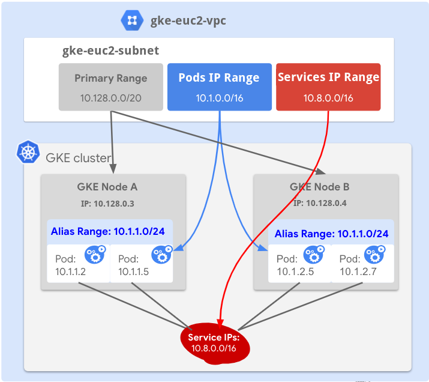
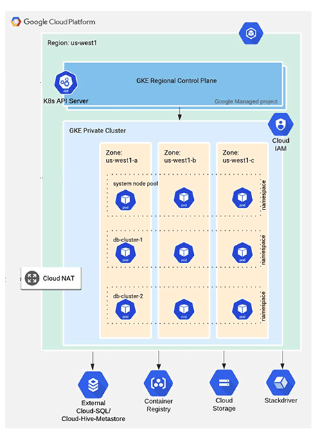

# gcp-project
Terraform templates and Ansible playbook for automating GKE cluster and GCE instance creation

# Table of Contents
1. [Introduction](#introduction)
2. [Prerequisites](#prerequisites)
    *  [Install required tools](#install-required-tools)
        *  [Install and configure gcloud SDK](#install-and-configure-gcloud-sdk)
        *  [Create a Service Account for Ansible](#create-a-service-account-for-ansible)
        *  [Install kubectl gke-gcloud-auth-plugin](#install-kubectl-gke-gcloud-auth-plugin)
        *  [Install Terraform](#install-terraform)
        *  [Install Ansible](#install-ansible)
        *  [Install kubectl](#install-kubectl)
3. [Terraform](#terraform)
    *  [Set up Terraform workspace](#set-up-terraform-workspace)
        *  [bucket](#bucket)
        *  [vpc](#vpc)
        *  [cluster](#cluster)
        *  [airflow](#airflow)
    *  [Initialize Terraform code](#initialize-terraform-code)
        *  [Google Cloud Storage bucket](#google-cloud-storage-bucket)
        *  [Google Cloud VPC network](#google-cloud-vpc-network)
        *  [GKE cluster](#gke-cluster)
        *  [Apache Airflow](#apache-airflow)
4. [Ansible](#ansible)
    *  [Set up Ansible workspace](#set-up-ansible-workspace)
    *  [Run Ansible playbook](#run-ansible-playbook)
5. [Useful links](#useful-links)


## Introduction
The Google Kubernetes Engine (GKE) is a fully managed Kubernetes service for deploying, managing, and scaling containerized applications on Google Cloud.

In this tutorial, you will deploy a 3-node GKE cluster using Terraform. This GKE cluster will be distributed across multiple zones for high availability. Then, you will configure kubectl using Terraform output to deploy the [Apache Airflow](https://airflow.apache.org/) on the cluster with [helm](https://helm.sh/).


## Prerequisites
The tutorial assumes some basic familiarity with [Kubernetes](https://kubernetes.io/docs/home/) and [kubectl](https://kubernetes.io/docs/reference/kubectl/) but does not assume any pre-existing deployment.

It also assumes that you are familiar with the usual Terraform plan/apply workflow. If you're new to Terraform itself, refer first to the Getting Started [tutorial](https://developer.hashicorp.com/terraform/tutorials/gcp-get-started) and internal [documentation](docs/terraform.md).

For this tutorial, you will need

* a [GCP account](https://console.cloud.google.com/)
* a configured [gCloud SDK](https://cloud.google.com/cli)
* [kubectl](https://kubernetes.io/docs/reference/kubectl/)
* [terraform](https://developer.hashicorp.com/terraform/downloads)
* [ansible](https://formulae.brew.sh/formula/ansible)

#### Install required tools
##### Install and configure gcloud SDK

In order for Terraform to run operations on your behalf, you must install and configure the gcloud SDK tool. To install the gcloud SDK, follow [these instructions](https://cloud.google.com/sdk/docs/quickstarts) or choose a  package manager based on your operating system.
You can also use the package manager `homebrew` to install the gcloud SDK.
```
$ brew install --cask google-cloud-sdk
```
After you've installed the `gcloud` SDK, initialize it by running the following command.
```
$ gcloud init
```
This will authorize the SDK to access GCP using your user account credentials and add the SDK to your PATH. This steps requires you to login and select the project you want to work in. Finally, add your account to the Application Default Credentials (ADC). This will allow Terraform to access these credentials to provision resources on GCloud.
```
$ gcloud auth application-default login
```

##### Create a Service Account for Ansible
1. Go to [IAM & Admin](https://console.cloud.google.com/iam-admin/iam) service in your GCP console
2. Enable the IAM API
3. In your terminal, clone [this](https://github.com/simonkey007/gcp-project.git) repository.
    ```
    $ git clone https://github.com/simonkey007/gcp-project.git
    $ cd gcp-project/ansible
    ```
3. Get your Google Cloud project ID
    ```
    $ PROJECT_ID=$(gcloud config get-value project)
    ```
4. Using a gcloud CLI create new service role
    ```
    $ gcloud iam service-accounts create ansible-compute-admin \
        --description="Ansible Compute Admin" \
        --display-name="ansible-compute-admin"
    ```
5. Bind your Service Account with `Compute Admin` IAM role
    ```
    $ gcloud projects add-iam-policy-binding $PROJECT_ID \
    --member="serviceAccount:ansible-compute-admin@$PROJECT_ID.iam.gserviceaccount.com" \
    --role="roles/compute.admin"
    ```
5. Create a Service Account key
    ```
    gcloud iam service-accounts keys create ansible-admin-sa.json \
    --iam-account=ansible-compute-admin@$PROJECT_ID.iam.gserviceaccount.com
    ```
6. Move to repository root directory
    ```
    cd ..
    ```

To create Service Account and its key by using Google Cloud console please follow these docs:
[Create Service Account](https://cloud.google.com/iam/docs/creating-managing-service-accounts#creating)
[Create Service Account key](https://cloud.google.com/iam/docs/creating-managing-service-account-keys#creating)


##### Install kubectl gke-gcloud-auth-plugin
```
gcloud components install gke-gcloud-auth-plugin
```
##### Install Terraform
```
brew tap hashicorp/tap
brew install hashicorp/tap/terraform
```
##### Install Ansible
```
brew install ansible
```
##### Install kubectl
```
brew install kubectl
```
## Terraform
### Set up Terraform workspace
Navigate to `terraform` directory in the repository
```
$ cd terraform
```
You will find three directories `bucket`, `vpc` and `cluster`
In each directory you have terraform files used to provision certain resources in GCP. These files are described [here](docs/terraform.md#files).
Each directory has also a `config` directory inside, that holds `config.remote` and `terraform.tfvars` files which have to be adjusted with your project details.<br>
##### bucket
This directory has terraform files that provisions a Google Cloud Storage bucket for storing Terraform state files of created GCP resources
* Navigate to its `config` directory
    ```
    $ cd config
    ```
* Replace the values in the `terraform.tfstate` file with your `project_id`, `region` and `bucket_name_prefix`. Terraform will use these values to target your project when provisioning storage resources. Your `terraform.tfvars` file should look like the following.
    ```
    # terraform.tfvars
    project_id         = "my-project-368815"
    region             = "europe-central2"
    bucket_name_prefix = "chatbot-org-terraform"
    storage_class      = "REGIONAL"
    ```
* Replace the values in the `config.remote` file with the bucket name you would like to create e.g. `chatbot-org-terraform-euc2` and prefix under which you will store Terraform state file e.g. `gcs/buckets/chatbot-org-terraform-euc2`. The last part of the prefix should be a bucket name which should be a combination of `bucket_name_prefix` from `terraform.tfvars` file and `region_code` from `locals.tf` file. Terraform will use these values to target created bucket for storing state file. Your `config.remote` file should look like the following.
    ```
    # config.remote
    bucket = "chatbot-org-terraform-euc2"
    prefix = "gcs/buckets/chatbot-org-terraform-euc2"
    ```
##### vpc
This directory has terraform files that provisions a Google Cloud VPC network for GKE clusters
* Navigate to its `config` directory
    ```
    $ cd config
    ```
* Replace the values in the `terraform.tfstate` file with your `project_id`, `region`, `network_name`, `subnetwork_name`, `subnetwork_ip_range`, `pods_ip_range`, and `services_ip_range`. Terraform will use these values to target your project when provisioning network resources. Your `terraform.tfvars` file should look like the following.
    ```
    # terraform.tfvars
    project_id          = "my-project-368815"
    region              = "europe-central2"
    network_name        = "gke-euc2-vpc"
    subnetwork_name     = "gke-euc2-subnet"
    subnetwork_ip_range = "10.0.0.0/24"
    pods_ip_range       = "10.1.0.0/24"
    services_ip_range   = "10.2.0.0/24"
    ```
* Replace the values in the `config.remote` file with the bucket name e.g. `chatbot-org-terraform-euc2` and prefix e.g. `vpc/gke-euc2-vpc` under which you will store Terraform state file. Terraform will use these values to target specified bucket for storing state file. Your `config.remote` file should look like the following.
    ```
    # config.remote
    bucket = "chatbot-org-terraform-euc2"
    prefix = "vpc/gke-euc2-vpc"
    ```
##### cluster
This directory has terraform files that provisions a Google Cloud GKE cluster
* Navigate to its `config` directory
    ```
    $ cd config
    ```
* Replace the values in the `terraform.tfstate` file with your `project_id`, `region`, `cluster_name`, `node_pool_name`, `node_machine_type`, and `num_nodes_per_zone`. Terraform will use these values to target your project when provisioning GKE and Kubernetes resources. Your `terraform.tfvars` file should look like the following.
    ```
    # terraform.tfvars
    project_id          = "my-project-368815"
    region              = "europe-central2"
    cluster_name        = "chatbots-euc2-prod"
    node_pool_name      = "primary-node-pool"
    node_machine_type   = "e2-standard-2"
    num_nodes_per_zone  = 1
    ```
* Replace the values in the `config.remote` file with the bucket name e.g. `chatbot-org-terraform-euc2` and prefix e.g. `gke/clusters/chatbots-euc2-prod` under which you will store Terraform state file. Terraform will use these values to target specified bucket for storing state file. Your `config.remote` file should look like the following.
    ```
    # config.remote
    bucket = "chatbot-org-terraform-euc2"
    prefix = "gke/clusters/chatbots-euc2-prod"
    ```
##### airflow
This directory has terraform files that deploys Apache Airflow on Google Cloud GKE cluster
* Navigate to its `config` directory
    ```
    $ cd config
    ```
* Replace the values in the `terraform.tfstate` file with your `airflow_username`. Terraform will use this value to target your project when deploying Apache Airflow service on GKE cluster. Your `terraform.tfvars` file should look like the following.
    ```
    # terraform.tfvars
    airflow_username = "admin"
    ```
* Replace the values in the `config.remote` file with the bucket name e.g. `chatbot-org-terraform-euc2` and prefix e.g. `gke/clusters/chatbots-euc2-prod/addons/airflow` under which you will store Terraform state file. Terraform will use these values to target specified bucket for storing state file. Your `config.remote` file should look like the following.
    ```
    # config.remote
    bucket = "chatbot-org-terraform-euc2"
    prefix = "gke/clusters/chatbots-euc2-prod/addons/airflow"
    ```
You can find the project your `gcloud` is configured to with this command.
```
$ gcloud config get-value project
```
The region has been defaulted to `europe-central2`. You can find a full list of `gcloud` regions [here](https://cloud.google.com/compute/docs/regions-zones).

### Initialize Terraform code
#### Google Cloud Storage bucket
Create the Google Cloud Storage bucket for storing Terraform state files of GCP resorces. To avoid the chicken and egg problem described [here](https://dev.to/shihanng/managing-s3-bucket-for-terraform-backend-in-the-same-configuration-2c6c) as the bucket must exist prior to configuring the Terraform backend, the GCS bucket will be created with the local backend first and then after its creation Teraform state file will be migrated to GCS by changing backend type from local to gcs. To perform this action you need to navigate to `terraform` directory and run the `bucket.sh` script.
```
$ ./bucket.sh
```

**Terraform**

| Name | Version |
|------|---------|
| [terraform](https://developer.hashicorp.com/terraform/downloads) | >= 1.0.11 |

**Providers**

| Name | Version |
|------|---------|
| [google](https://registry.terraform.io/providers/hashicorp/google/latest/docs) | 4.43.1 |
| [google-beta](https://registry.terraform.io/providers/hashicorp/google-beta/latest/docs) |  4.43.1 |

**Modules**

No modules

**Resources**

| Name | Type |
|------|------|
| [google_storage_bucket.tf-bucket](https://registry.terraform.io/providers/hashicorp/google/latest/docs/resources/storage_bucket) | resource |

**Inputs**

| Name | Description | Type | Default | Required |
|------|-------------|------|---------|:--------:|
| project_id         | The GCP project ID to host the cluster in                | `string` | n/a               | yes |
| region             | The GCP region to host the cluster in                    | `string` | `europe-central2` | no  |
| bucket_name_prefix | The prefix of the Google Storage Bucket to create        | `string` | n/a               | yes |
| storage_class      | The storage class of the Google Storage Bucket to create | `string` | n/a               | yes |

**Outputs**

| Name | Description |
|------|-------------|
| bucket_name | The Google Storage Bucket name |
| bucket_url  | The Google Storage Bucket URL  |

#### Google Cloud VPC network
Create the Google Cloud VPC network where GKE cluster will be running. The network configuration will consist of one vpc with subnetwork and two additional secondary ranges for cluster's pods and services.
To create VPC with Terraform you need to navigate to `terraform` directory and run the `vpc.sh` script. 

```
$ ./vpc.sh
```


**Terraform**

| Name | Version |
|------|---------|
| [terraform](https://developer.hashicorp.com/terraform/downloads) | >= 1.0.11 |

**Providers**

| Name | Version |
|------|---------|
| [google](https://registry.terraform.io/providers/hashicorp/google/latest/docs) | 4.43.1 |
| [google-beta](https://registry.terraform.io/providers/hashicorp/google-beta/latest/docs) |  4.43.1 |

**Modules**

| Name | Version |
|------|---------|
| [terraform-google-modules/network/google.gcp-network](https://registry.terraform.io/modules/terraform-google-modules/network/google/latest) | 5.2.0 |


**Resources**

No resources

**Inputs**

| Name | Description | Type | Default | Required |
|------|-------------|------|---------|:--------:|
| project_id             | The GCP project ID to host the cluster in      | `string` | n/a                  | yes |
| region                 | The GCP region to host the cluster in          | `string` | `europe-central2`    | no  |
| network_name           | The VPC network name to host the cluster in    | `string` | `default-vpc`        | no  |
| subnetwork_name        | The subnetwork created to host the cluster in  | `string` | `default-gke-subnet` | no  |
| subnetwork_ip_range    | The subnetwork IP range to host the cluster in | `string` | `10.0.0.0/24`        | no  |
| pods_ip_range_name     | The pods secondary ip range name               | `string` | `ip-range-pods`      | no  |
| services_ip_range_name | The services secondary ip range name           | `string` | `ip-range-svc`       | no  |
| pods_ip_range          | The secondary ip range to use for pods         | `string` | `10.1.0.0/24`        | no  |
| services_ip_range      | The secondary ip range to use for services     | `string` | `10.0.0.0/24`        | no  |

**Outputs**

| Name | Description |
|------|-------------|
| project_id             | The GCP project ID                     |
| region                 | The GCP region                         |
| vpc_id                 | The ID of the VPC being created        |
| vpc_name               | The name of the VPC being created      |
| subnets_names          | The names of the subnets being created |
| pods_ip_range_name     | The pods secondary ip range name       |
| services_ip_range_name | The services secondary ip range name   |

#### GKE cluster
Create the [GKE regional cluster](https://cloud.google.com/kubernetes-engine/docs/concepts/regional-clusters) that will consist of one node pool spreaded across three zones within a single region. To create the GKE cluster with Terraform you need to navigate to `terraform` directory and run the `cluster.sh` script. 

```
$ ./cluster.sh
```


**Terraform**

| Name | Version |
|------|---------|
| [terraform](https://developer.hashicorp.com/terraform/downloads) | >= 1.0.11 |

**Providers**

| Name | Version |
|------|---------|
| [google](https://registry.terraform.io/providers/hashicorp/google/latest/docs) | 4.43.1 |
| [google-beta](https://registry.terraform.io/providers/hashicorp/google-beta/latest/docs) |  4.43.1 |
| [kubernetes](https://registry.terraform.io/providers/hashicorp/kubernetes/latest/docs) | 2.16.0 |

**Modules**

| Name | Version |
|------|---------|
| [terraform-google-modules/kubernetes-engine/google.gke](https://registry.terraform.io/modules/terraform-google-modules/kubernetes-engine/google/latest) | 23.3.0 |


**Resources**

| Name | Type |
|------|------|
| [terraform_remote_state.vpc](https://registry.terraform.io/providers/hashicorp/terraform/latest/docs/data-sources/remote_state) | data source |

**Inputs**

| Name | Description | Type | Default | Required |
|------|-------------|------|---------|:--------:|
| project_id         | The GCP project ID to host the cluster in                               | `string` | n/a                  | yes |
| region             | The GCP region to host the cluster in                                   | `string` | `europe-central2`    | no  |
| cluster_name       | The GKE cluster name                                                    | `string` | `chatbots-euc2-prod` | no  |
| node_pool_name     | The name of GKE cluster node pool                                       | `string` | `default-node-pool`  | no  |
| num_nodes_per_zone | The number of GKE nodes per zone                                        | `number` | 1                    | no  |
| node_machine_type  | The name of a Google Compute Engine machine type for GKE cluster nodes  | `string` | `e2-medium`          | no  |

**Outputs**

| Name | Description |
|------|-------------|
| project_id              | The GCP project ID to host the cluster in                |
| region                  | The GCP region to host the cluster in                    |
| cluster_name            | The GKE cluster name                                     |
| cluster_endpoint        | The GKE cluster endpoint                                 |
| cluster_ca_certificate  | The GKE cluster CA certificate                           |
| cluster_service_account | The service account to default running GKE cluster nodes |

#### Apache Airflow
Deploy the [Apache Airflow](https://airflow.apache.org/) with the [Helm chart](https://airflow.apache.org/docs/helm-chart/stable/index.html). To deploy the Apache Airflow service on GKE cluster with Terraform you need to navigate to `terraform` directory and run the `airflow.sh` script. 

```
$ ./airflow.sh
```
**Terraform**

| Name | Version |
|------|---------|
| [terraform](https://developer.hashicorp.com/terraform/downloads) | >= 1.0.11 |

**Providers**

| Name | Version |
|------|---------|
| [helm](https://registry.terraform.io/providers/hashicorp/helm/latest/docs) | 2.7.1 |
| [kubernetes](https://registry.terraform.io/providers/hashicorp/kubernetes/latest/docs) | 2.16.0 |

**Modules**

No modules

**Resources**

| Name | Type |
|------|------|
| [helm_release.airflow](https://registry.terraform.io/providers/hashicorp/helm/latest/docs/resources/release) | resource |
| [terraform_remote_state.gke](https://registry.terraform.io/providers/hashicorp/terraform/latest/docs/data-sources/remote_state) | data source |
| [google_client_config.default](https://registry.terraform.io/providers/hashicorp/google/latest/docs/data-sources/client_config) | data source |
| [kubernetes_service.airflow-webserver](https://registry.terraform.io/providers/hashicorp/kubernetes/latest/docs/data-sources/service) | data source |

**Inputs**

| Name | Description | Type | Default | Required |
|------|-------------|------|---------|:--------:|
| airflow_username | The airflow username | `string` | `admin` | no |

**Outputs**

| Name | Description |
|------|-------------|
| airflow_username | The Apache Airflow username |
| airflow_password | The Apache Airflow password |
| airflow_endpoint | The Apache Airflow endpoint URL |
## Ansible
### Set up Ansible workspace
Navigate to `ansible` directory in the repository
```
$ cd ansible
```
Replace value for `project_id` property in the `vars.yaml` file with your Google Cloud Project ID. Your `vars.yaml` file should look like the following.
```
# vars.yaml
service_account_file: "ansible-admin-sa.json"
project_id: "my-project-368815"
instance_template_name: "mysql-instance"
machine_type: "c2-standard-8"
disk_size: "200"
disk_type: "pd-ssd"
disk_image: "projects/centos-cloud/global/images/centos-7-v20221102"
zone: "us-central1-a"
number_of_instances: 1
```
### Run Ansible playbook
Run playbook with the following command.
```
ansible-playbook playbook.yaml
```
    
## Useful links
* [Install the Google Cloud CLI](https://cloud.google.com/sdk/docs/quickstarts)
* [Create Google Cloud Storage bucket](https://cloud.google.com/sdk/gcloud/reference/storage/buckets/create)
* [Google Cloud Storage bucket locations](https://cloud.google.com/storage/docs/locations)
* [Google Cloud Storage bucket versioning](https://cloud.google.com/storage/docs/gsutil/commands/versioning)
* [Google Cloud GKE: Overview](https://cloud.google.com/kubernetes-engine/docs/concepts/kubernetes-engine-overview)
* [Google Cloud GKE: Regional clusters](https://cloud.google.com/kubernetes-engine/docs/concepts/regional-clusters)
* [Google Cloud GKE: Teraform module for configuring GKE clusters](https://registry.terraform.io/modules/terraform-google-modules/kubernetes-engine/google/latest)
* [Apache Airflow: Helm chart on Github](https://github.com/apache/airflow/tree/main/chart)
* [Kubectl authentication in GKE](https://cloud.google.com/blog/products/containers-kubernetes/kubectl-auth-changes-in-gke)
* [Ansible: gcp_compute_disk module](https://docs.ansible.com/ansible/latest/collections/google/cloud/gcp_compute_disk_module.html)
* [Ansible: gcp_compute_image module](https://docs.ansible.com/ansible/latest/collections/google/cloud/gcp_compute_image_module.html)
* [Ansible: gcp_compute_instance_template module](https://docs.ansible.com/ansible/latest/collections/google/cloud/gcp_compute_instance_template_module.html)
* [Ansible: gcp_compute_instance_group_manager module](https://docs.ansible.com/ansible/latest/collections/google/cloud/gcp_compute_instance_group_manager_module.html)
* [GCP VM: Using startup scripts](https://cloud.google.com/compute/docs/instances/startup-scripts/linux)
* [How to install mySQL Server on CentOS 7](https://www.hostinger.com/tutorials/how-to-install-mysql-on-centos-7)
