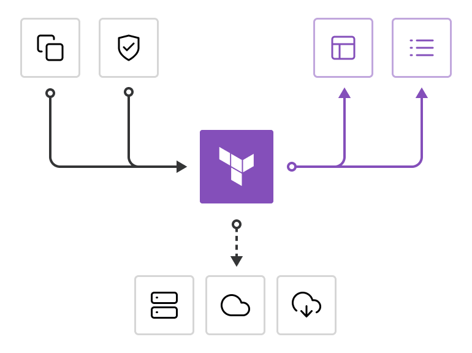

# What is Terraform
Terraform is an infrastructure as code tool that lets you build, change, and version infrastructure safely and efficiently. This includes low-level components like compute instances, storage, and networking; and high-level components like DNS entries and SaaS features.

# Backend
Terraform uses persisted state data to keep track of the resources it manages. Terraform use a backend to store state remotely. This lets multiple people access the state data and work together on that collection of infrastructure resources. For the purpose of this project [gcs](https://developer.hashicorp.com/terraform/language/settings/backends/gcs) backend is being used.

# Providers
Terraform relies on plugins called providers to interact with cloud providers, SaaS providers, and other APIs.

Terraform configurations must declare which providers they require so that Terraform can install and use them. Additionally, some providers require configuration (like endpoint URLs or cloud regions) before they can be used.

Each provider adds a set of resource types and/or data sources that Terraform can manage.

Every resource type is implemented by a provider; without providers, Terraform can't manage any kind of infrastructure.

Most providers configure a specific infrastructure platform (either cloud or self-hosted). Providers can also offer local utilities for tasks like generating random numbers for unique resource names.

The following providers are being used in this project:
* [Google Cloud Platform Provider](https://registry.terraform.io/providers/hashicorp/google/latest/docs)
* [Kubernetes Provider](https://registry.terraform.io/providers/hashicorp/kubernetes/latest/docs)
* [Helm Provider](https://registry.terraform.io/providers/hashicorp/helm/latest/docs)

# Variables and Outputs
The Terraform language includes a few kinds of blocks for requesting or publishing named values.

* [Input Variables](https://developer.hashicorp.com/terraform/language/values/variables) serve as parameters for a Terraform module, so users can customize behavior without editing the source.
* [Output Values](https://developer.hashicorp.com/terraform/language/values/outputs) are like return values for a Terraform module.
* [Local Values](https://developer.hashicorp.com/terraform/language/values/locals) are a convenience feature for assigning a short name to an expression.

# Resources
Resources are the most important element in the Terraform language. Each resource block describes one or more infrastructure objects, such as virtual networks, compute instances, or higher-level components such as DNS records.

# Files
Code in the Terraform language is stored in plain text files with the .tf file extension. Files containing Terraform code are often called configuration files.
The following files have been created in this project structure.

`backend.tf` - backend definition where Terraform stores its state data files

`locals.tf` - provides local variables definition

`main.tf` - provides resources and data sources definition

`outputs.tf` - expose information about certain created resources for other Terraform configurations to use

`providers.tf` - provides providers configuration

`variables.tf` - provides input variables definition

`versions.tf` - provides information about terraform version and providers declaration so Terraform can install them and 

[.terraform.lock.hcl](https://developer.hashicorp.com/terraform/language/files/dependency-lock) - is an additional HCL file that can be included with a configuration, it tells Terraform to always use a specific set of provider versions
